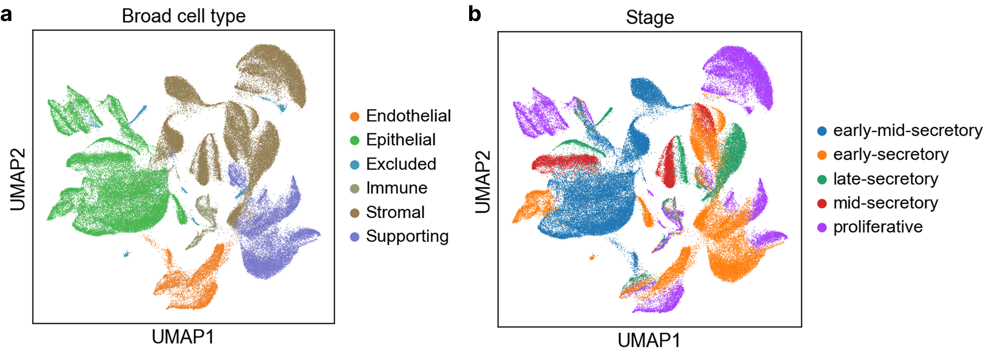
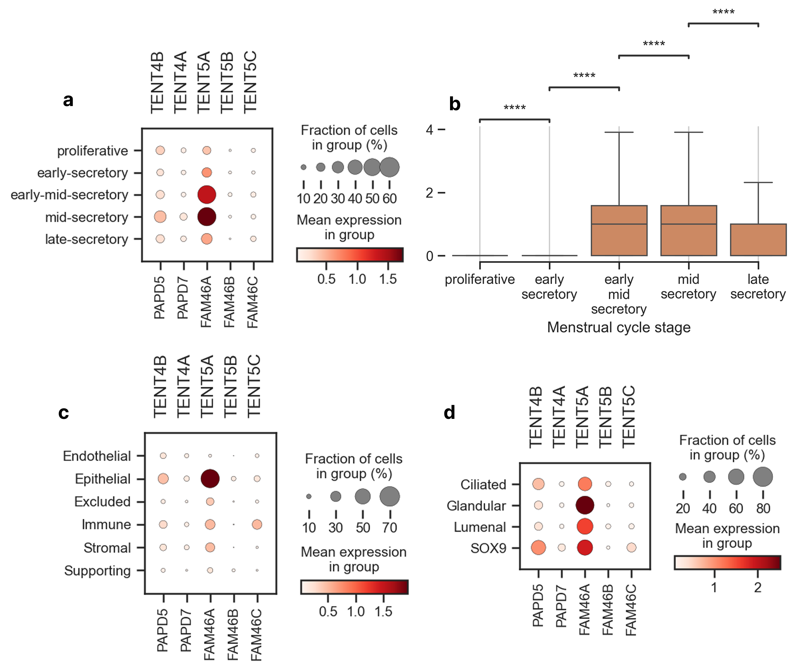
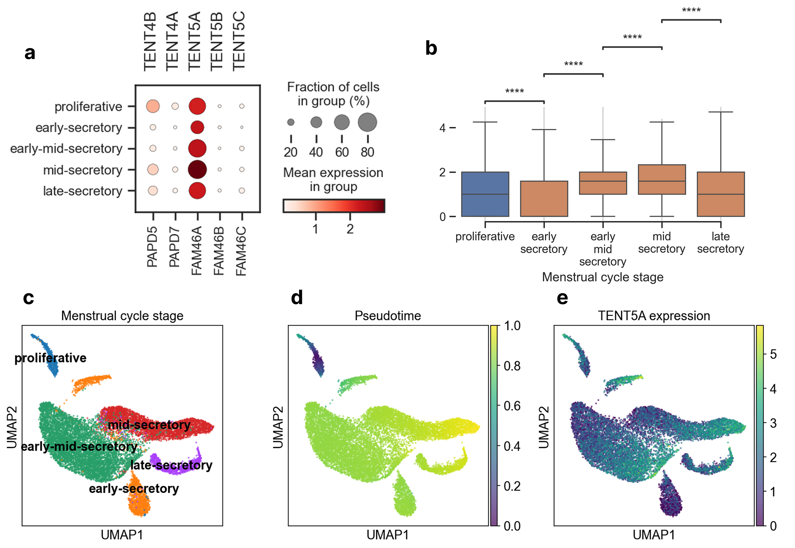
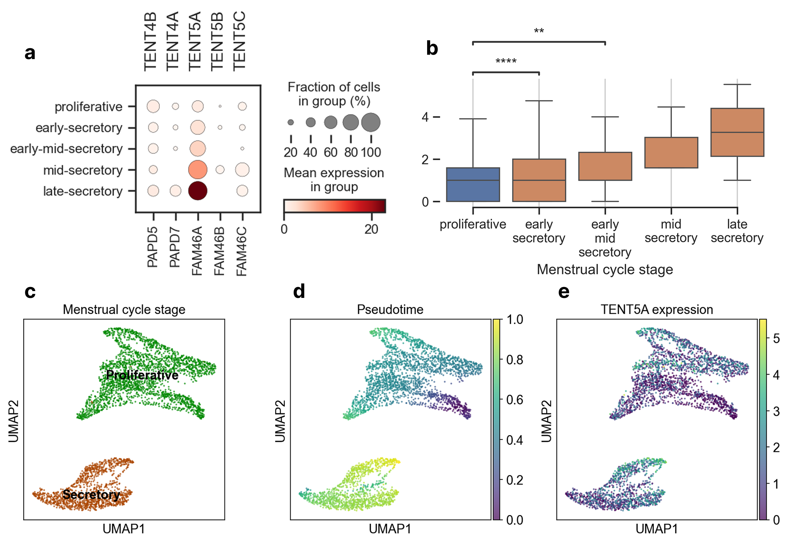

# Overwiew
Transcriptomic analysis of human endometrium and exploration of TENT protein family role in endometrial cells and in the menstrual cycle. To read the full report go to &rarr; `mn_msb_report.pdf`.

# Data
RNA single-cell sequencing data publish in [Mapping the temporal and spatial dynamics of the human endometrium in vivo and in vitro](https://www.nature.com/articles/s41588-021-00972-2) and available under Endometrium tab in the [Reproductive Cell Atlas](https://www.reproductivecellatlas.org/non-pregnant-uterus.html).

# Pipeline

1. `qc.ipynb` &rarr; quality control,
2. `preparation.ipynb` &rarr; doublet detection, data filtering and normalization,
3. `pc.ipynb` &rarr; feature selection and PCA,
4. `clustering.ipynb` &rarr; UMAP and Leiden clustering,
5. `expression.ipynb` &rarr; expression of TENTs,
6. `trajectories.ipynb` &rarr; trajectory analysis with the focus on TENTs.

# Results
Exemplary results. Explanation and more in the `mn_msb_report.pdf`.

## Endometrium dataset outlook
UMAP is a modern dimensionality reduction technique. It stands for Uniform Manifold Approximation and Projection for Dimension Reduction. Here. I show the UMAP representation of the cells coloured by the broad cell type and menstrual cycle stage.

  

## TENTs expression in endometrium

  

## TENTs expression in glandular cells

  

## TENTs expression in SOX9 cells

  

